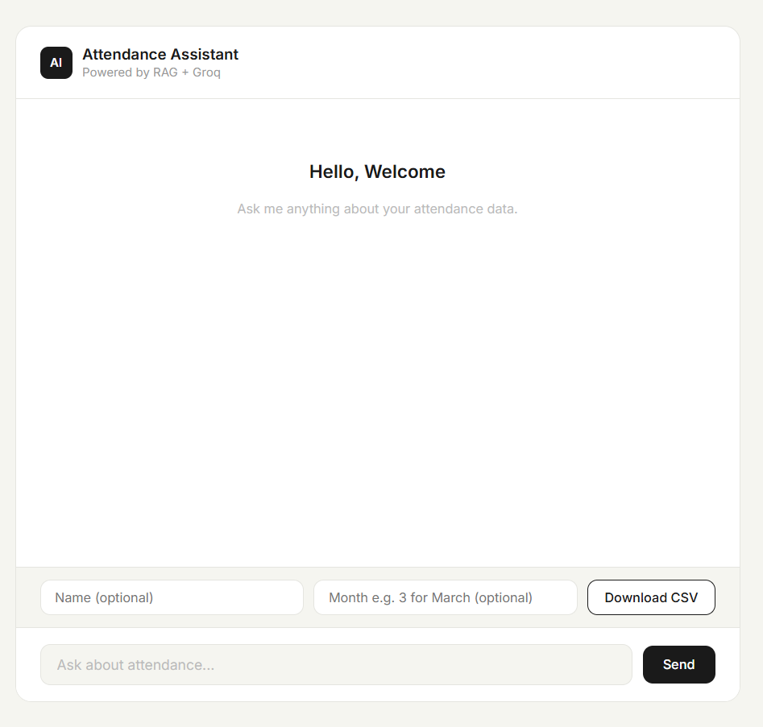

# AI Attendance Assistant

An intelligent attendance query system built on top of FaceAttend — a face recognition attendance project. Users can ask natural language questions about attendance data and download filtered CSV reports.



---

## What it does

- Ask questions like **"Who was present in March?"** and get instant AI answers
- Ask **"How many days was Vivek present?"** — AI counts exactly from real data
- Download filtered attendance as **CSV** by name, month, or both
- Maintains **conversation history** — AI remembers previous questions
- Auto-syncs attendance data from SQLite into ChromaDB on startup

---

## Tech Stack

| Layer | Technology |
|---|---|
| Backend | FastAPI, Python |
| AI / LLM | Groq API (llama-3.3-70b-versatile) |
| Vector Search | ChromaDB |
| Embeddings | SentenceTransformers (all-MiniLM-L6-v2) |
| Database | SQLite |
| Frontend | HTML, CSS, JavaScript |

---

## How it works

```
User question
      ↓
SentenceTransformer converts question to embedding
      ↓
ChromaDB searches most relevant attendance records
      ↓
Records passed as context to Groq LLM
      ↓
AI generates accurate answer from real data
      ↓
Answer shown in chat UI
```

---

## Project Structure

```
Ai-Attendance-Assistant/
├── main.py           # FastAPI backend — /chat, /download, /health
├── static/
│   └── index.html    # Chat UI frontend
├── chroma_store/     # ChromaDB vector database (auto-created)
├── .env              # API keys
├── requirements.txt  # Dependencies
└── README.md
```

---

## Run Locally

**1. Clone the repo**
```bash
git clone https://github.com/viveknayee/Ai-Attendance-Assistant
cd Ai-Attendance-Assistant
```

**2. Create virtual environment**
```bash
python -m venv venv
venv\Scripts\activate
```

**3. Install dependencies**
```bash
pip install -r requirements.txt
```

**4. Add your API key**

Create a `.env` file:
```
GROQ_API_KEY=your_groq_api_key_here
DB_PATH=your_database_path_here
```

**5. Update SQLite path**

In `main.py` update this line to your attendance database path:
```python
conn = sqlite3.connect(DB_PATH)
```

**6. Run the server**
```bash
uvicorn main:app --reload
```

**7. Open browser**
```
http://127.0.0.1:8000
```

---

## API Endpoints

| Method | Endpoint | Description |
|---|---|---|
| GET | `/` | Chat UI |
| POST | `/chat` | Ask attendance question |
| GET | `/download` | Download attendance CSV |
| GET | `/health` | Server health check |

**Download CSV examples:**
```
/download                          → all records
/download?name=Vivek               → Vivek all attendance
/download?name=Vivek&month=3       → Vivek March attendance
/download?month=4                  → everyone April attendance
```

---

## Built On

This project is an AI extension of **FaceAttend** — a face recognition attendance system built with Python, Flask, OpenCV, and dlib.

[View FaceAttend →](https://github.com/viveknayee)

---

## Skills Demonstrated

`LLM Integration` `RAG Pipeline` `FastAPI` `ChromaDB` `Prompt Engineering` `Vector Search` `REST API` `Python`

---

*Built by [Vivek Nayee](https://github.com/viveknayee)*
